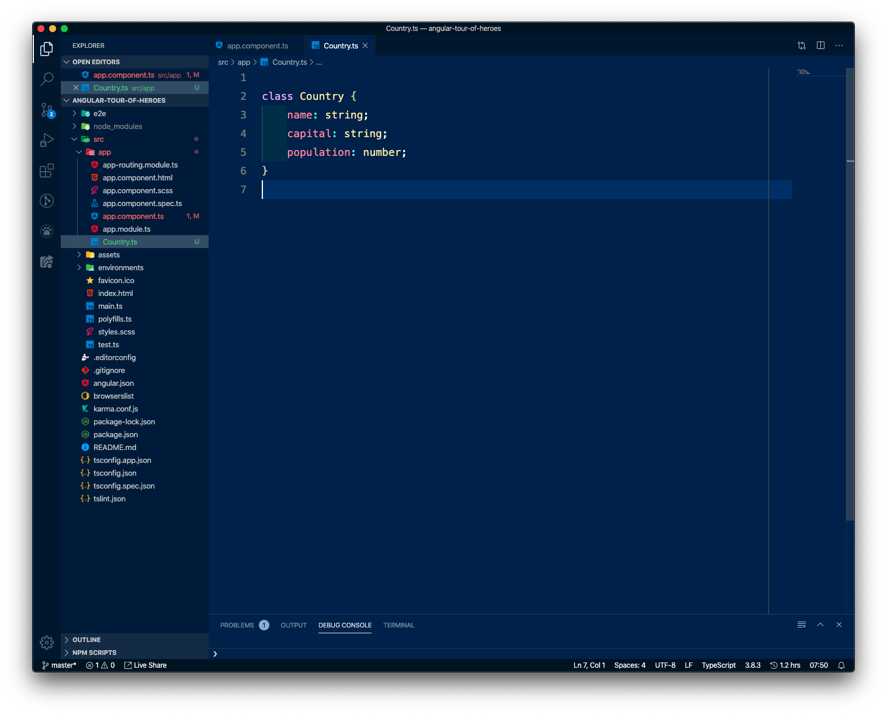
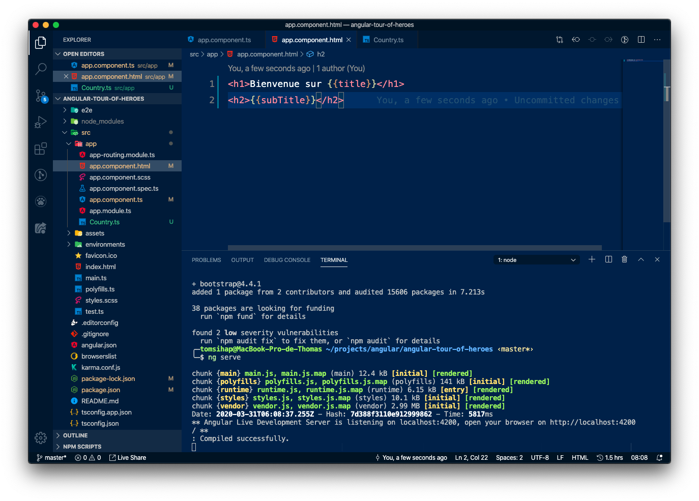

# Angular 9 : Des données dynamiques ! - Cours

> Dans cette partie, nous allons voir comment rendre notre code dynamique. Dans le cours précédent, nous avons vu comment créer un projet et construire notre premier component.

> Nous allons maintenant construire un nouveau projet basé sur *Tour of Heroes*, l'appli d'exemple de la documentation officielle de Angular que vous pouvez [retrouver ici](https://angular.io/tutorial) !

> Il s'agit d'un dashboard de gestion pour une agence de recrutement de héros : on pourra ajouter, modifier, lister nos héros.

> Vous apprendrez à lire la documentation de Angular et commencer à trouver les informations par vous-même.

> Nous irons ensuite un peu plus loin que le tutoriel Angular pour ajouter une gestion de combat entre nos héros !

## Créer le projet
- Faites l'[exercice 3](exercices.md#exercice-3).

Au fait, comment est géré le component principal de notre application, celui qui contient les autres components ? En fait, il est appelé dans le fichier `src/index.html` avec la  balise `<app-root>`.

Ce `<app-root>` correspond en fait au `app.component` qui se trouve déjà dans le dossier `src` et qui est composé, comme tous les composants, de trois éléments :
- `app.component.html` ce qui va être affiché
- `app.component.scss` le CSS propre à ce component
- `app.component.ts` la logique de ce component

C'est quoi, la "logique" du component ? C'est en fait tous les mécanismes, les variables, le code Javascript (enfin, Typescript !) qui sera utilisé dans ce component.

La structure de ce fichier est un peu particulière : on y trouve une *classe* `AppComponent`, au dessus, un *décorateur* `@Component()`... On découvrira petit à petit tous ces éléments.

Mais pour commencer, travaillons dans la classe `AppComponent` et ajoutons-lui une variable nommée `subTitle` et qui contiendra `"Ma première application Angular !"`.


C'est une variable un peu particulière : par de `var`, `let`, `const` ici ! En fait, quand on déclare une variable dans une classe, on appelle ça un *attribut*. C'est une variable un peu particulière qui appartient à la classe.

## Les classes

Une classe est une structure de code qui nous permet de stocker des informations bien triées dedans. Par exemple, un array ou un objet vous permettent de stocker et trier des lots d'informations (un array de noms, un array de pays avec ses habitants et sa capitale...).

Une classe, c'est un array... En mieux ! À un array, on peut lui donner toutes les informations que l'on souhaite, par exemple :

```js
let countries = [
    {
        name: "France",
        capital: "Paris",
        population: 66990000
    },
    {
        name: "Germany",
        capital: "Berlin",
        population: 82790000
    }
]
```

Mais on peut aussi lui donner des informations un peu bizarres sans aucun contrôle :
```js
let countries = [
    {
        name: "France",
        capital: "Paris",
        population: 66990000
    },
    {
        name: "Allemagne",
        capital: "Berlin",
        population: 82790000
    },
    {
        name: "Jar-Jar Binks",
        capital: "Otoh Gunga",
        friends: [
            "Qui-Gon Jinn",
            "Obi-Wan Kenobi"
        ]
    }
]
```

Une classe, c'est en fait un "super array" à qui on va définir le format de base, des données par défaut, pour éviter ce genre d'erreurs !

> Attention : à partir de maintenant, le code que nous saisissons est du Typescript. C'est à dire qu'il ne fonctionnera pas dans un fichier Javascript classique. Au final, lorsque l'on compile le Typescript, un fichier Javascript est créé en bout de file. L'avantage de Typescript, c'est donc d'utiliser des fonctionnalités avancées que Javascript seul n'a pas (ou qui sont difficiles à coder en Javascript natif, ou encore des fonctionnalités pas encore sorties).

Pour définir ce "format", nous allons dire qu'un pays doit avoir une capitale (en `string`) et une  population (en `number`). De plus, nous allons nommer notre classe `Country` puisqu'elle représente un pays.

- Créez le fichier `src/app/Country.php`. Attention au `C` majuscule ! Cette notation s'appelle `PascalCase` et est une convention obligatoire pour le nommage des classes.



Et voilà ! Je peux maintenant créer des pays sans risquer d'ajouter un champ inutile (auquel cas mon IDE me mettra une erreur !) :


Une classe, c'est aussi un nouveau type de données. De la même manière que `string` est un type de données qui possède tous les caractères possibles, `number` un type de données qui ne possède que des chiffres ou `object` qui possède plusieurs strings, numbers et sous objets, `Country` est un type de données qui possède une string `capital` et un number `population`.

Pour illustrer cela, vous pouvez créer une classe `Continent` (dans le même fichier pour cette fois car c'est un exercice) qui elle, contiendra un attribut `countries` qui prendra un tableau d'éléments de type... `Country` !

- Pour indiquer un tableau de string, on type avec `string[]`.
- Pour indiquer un tableau de `Country`, on type avec `Country[]`.


- Faites l'[exercice 4](exercices.md#exercice-4).
- Faites l'[exercice 5](exercices.md#exercice-5).

## Interpolation

Maintenant que notre classe possède des attributs, nous allons les utiliser à la manière de Angular pour les afficher dans notre page !

Angular possède un moteur de template qui permet par exemple d'utiliser dans la partie HTML des variables qui viennent de la partie Typescript. On appelle ça l'interpolation : c'est un mot savant qui veut simplement dire "insérer une variable qui vient d'un autre fichier" ! (mais c'est bien pour raconter son job à des amis : *j'ai du relancer mon serveur Angular parce que l'interpolation ne voulait pas marcher correctement mais sinon bonne journée et toi ?* 😎)

Concrètement, nous pouvons utiliser les variables définies dans la partie Typescript du component (ici: `app.component.ts`) en les appelant dans la partie HTML du component (ici: `app.component.html`) en saisissant le code suivant:

> Note: vous pouvez supprimer l'intégralité du contenu de `app.component.html` comme d'habitude sans risques : c'est simplement le code qui vient par défaut à la construction de l'application !

> N'oubliez pas de relancer votre serveur si ça n'est pas déjà le cas !



Vous allez maintenant mettre en pratique toutes vos connaissances pour créer un component `heroes` qui contiendra la liste des héros.

- Faites l'[exercice 6](exercices.md#exercice-4).
